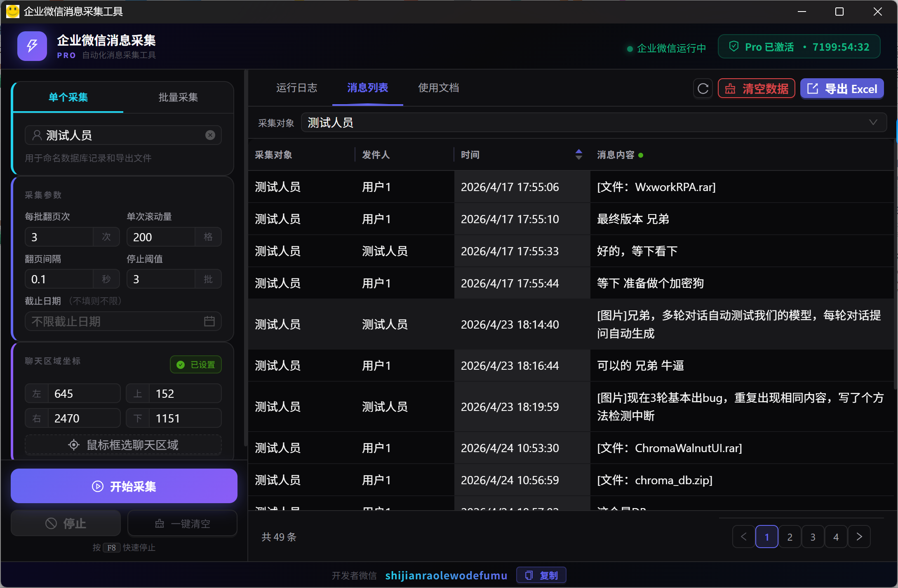
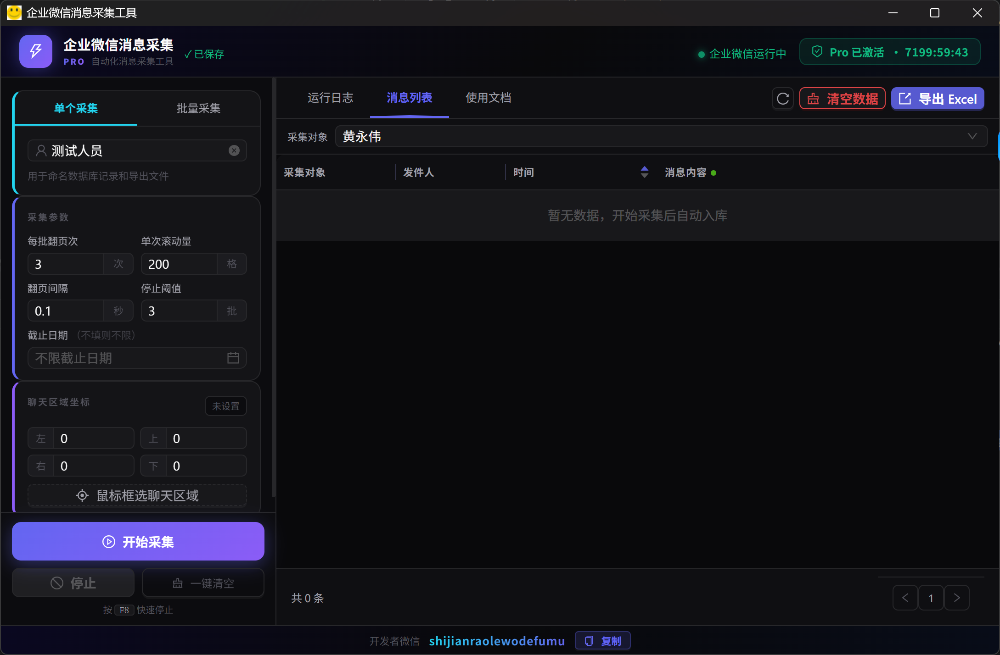

# WeCom Chat Export Tool · Enterprise WeChat Message Collector

> No Session Archive Required · Group & Direct Chats · Batch Mode · One-Click Excel Export

An RPA-based automation tool that captures WeCom (Enterprise WeChat) group and
direct chat messages and exports them to Excel. Supports batch multi-target
collection, incremental capture with cut-off date filtering, and fully
unattended operation — ideal for compliance archiving, customer service QA,
and data analytics.

**No installation needed. Download, extract, and run on Windows.**



---

## Features

- **Real-Time Message Capture** — Automatically locates the WeCom window, scrolls through chat history, and saves messages to a local database in real time
- **Unattended Batch Mode** — Upload an Excel target list; the tool switches between groups/contacts and collects each one in sequence — no human intervention needed
- **Excel Export** — Exports formatted spreadsheets with headers, alternating row colors, borders, and auto-fitted column widths
- **Visual Area Selection** — Full-screen dark overlay + mouse drag to precisely frame the chat message area
- **Cut-off Date Filter** — Only collect messages after a specified date; incremental capture with zero duplicates
- **Auto-Save Config** — All coordinates, parameters, and date settings persist automatically and restore on next launch
- **WeCom Status Monitor** — Polls the WeCom process in real time; running state is always visible

---

## Screenshots




---

## Use Cases

| Scenario | Description |
|----------|-------------|
| Compliance Archiving | Periodically collect WeCom group messages to meet internal retention policies |
| Customer Service QA | Export service chat records to evaluate quality and response time |
| Data Analytics | Batch-export messages from multiple groups for keyword frequency, activity analysis, and more |
| Project Audit Trail | Capture project group chats so key decisions remain traceable and searchable |
| Information Backup | Consolidate important notices and decisions scattered across groups into a single export |

---

## Quick Start

### System Requirements

- Windows 10 / 11 (64-bit)
- WeCom (WXWork) installed and logged in
- The WeCom window must remain **visible** during collection (do not minimize to the system tray)

### Installation

```bash
git clone https://github.com/shendudian/wx_chat_export.git
```

Once cloned, double-click `wx_rpa_chat-win-amd64.exe` in the directory to launch — no dependencies or installation required.

### Collection Workflow

1. Confirm the status indicator in the top-right corner is **green** (WeCom running)
2. Enter the target name (group or contact — must **exactly match** the name in the WeCom sidebar), or switch to **Batch Mode** and upload a target list
3. Click **"Select Chat Area"** — when the screen dims, drag to frame the message area (**exclude the input box**)
4. Adjust collection parameters as needed: page turns, scroll amount, interval, stop threshold
5. Click **"Start Collection"** — the tool scrolls and captures automatically with live progress display
6. When done, view results in the **Message List** tab and click **"Export Excel"** to save

> **Shortcut**: Press `F8` at any time during collection to stop immediately.

### Batch Collection

1. Click **"Download Template"** to get the Excel template
2. Fill in all group names or contact names in the **"Target"** column
3. Click **"Upload List"** to import
4. Click **"Start Collection"** — the tool processes each target in order automatically

---

## Collection Parameters

| Parameter | Description | Default | Range |
|-----------|-------------|---------|-------|
| Page Turns per Batch | Number of upward scrolls per collection round | 3 | 1–50 |
| Scroll Amount | Distance scrolled per step | 10 | 1–200 |
| Scroll Interval | Wait time between scrolls | 1.5 s | 0.1–5.0 |
| Stop Threshold | Stop after this many consecutive batches with no new content | 4 | 1–20 |
| Cut-off Date | Only collect messages after this date (optional) | None | YYYY-MM-DD |

> Increase page turns and scroll amount for high-volume chats. Increase the interval if WeCom responds slowly.

---

## Troubleshooting

| Issue | Solution |
|-------|----------|
| No messages collected | Verify the selected area covers the message list, not the input box |
| "WeCom not found" error | Ensure the WeCom window is visible and not minimized to the system tray |
| Navigation skipped | The target name must exactly match the WeCom sidebar — watch for spaces and special characters |
| Coordinate drift | High-DPI screens are auto-adapted; re-select the area after resizing the WeCom window |

> For other issues, check the **System Log** tab for detailed error messages before contacting the developer.

---

## Disclaimer

<details>
<summary>Click to expand</summary>

This tool uses accessibility-level UI automation on the WeCom desktop client
and does not involve protocol reverse engineering, memory injection, or any
unofficial interfaces. Users are responsible for ensuring their use complies
with internal company policies and applicable laws. Only collect chat content
you are authorized to access. The developer assumes no liability for
unauthorized or non-compliant use.

</details>

---

## Contact

WeChat: **shijianraolewodefumu**

For licensing inquiries or technical support, reach out via WeChat.

---

<!-- SEO -->
> Keywords: WeCom chat export · Enterprise WeChat message collector · WeCom group message export Excel · WeChat Work chat history backup · WeCom RPA tool · WeCom automation · batch chat export · Enterprise WeChat data export · WeCom compliance archiving · WeChat Work exporter · WeCom message scraper · enterprise chat backup
