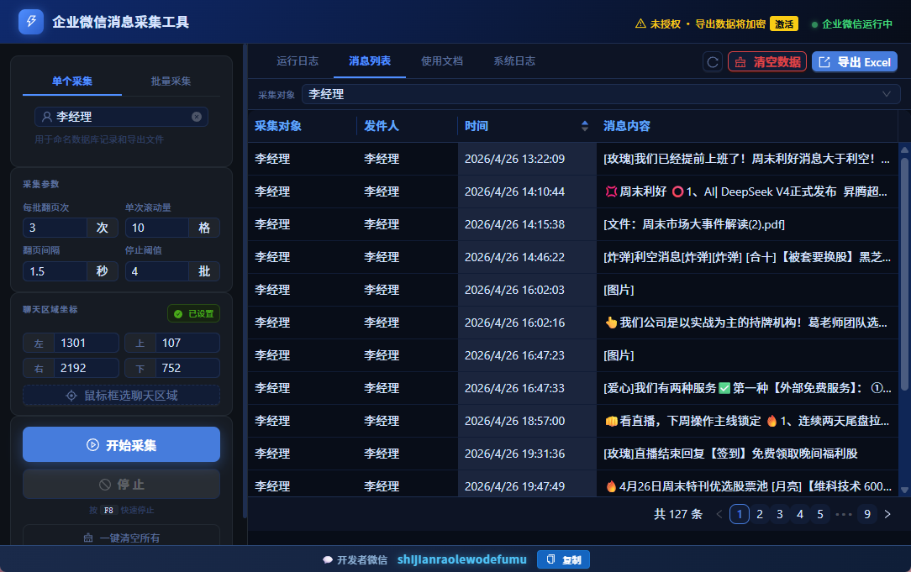

# 企业微信消息采集工具

面向企业场景的企微群聊/私聊消息自动化采集与聊天记录导出工具。支持实时拉取企业微信群消息、批量采集多个对象、聊天记录导出为 Excel，适用于企业合规存档、客服质检、数据分析等业务需求。
不需要开启会话存档模式

## 功能概览

- **消息采集** — 自动定位企业微信聊天窗口，滚动选取并复制群聊/私聊消息，实时入库
- **批量采集** — 上传 Excel 目标列表，按顺序逐个自动切换并采集，全程无人值守
- **聊天记录导出** — 将采集数据导出为专业排版 Excel（表头、交替行色、边框、自适应列宽）
- **可视化坐标框选** — 全屏截图叠加暗色遮罩，鼠标拖拽精确框定聊天消息区域
- **截止日期过滤** — 设置日期后仅采集该日期之后的消息，避免重复抓取历史数据
- **数据加密存储** — 消息内容入库即加密（Fernet 对称加密），数据库文件无法直接阅读
- **配置自动保存** — 所有参数、坐标、截止日期变更后自动持久化，重启即恢复
- **企业微信状态检测** — 实时轮询企微进程，窗口运行状态一目了然
- **机器码授权** — RSA 签名验证 + 硬件指纹绑定，授权到期自动提醒

## 使用场景

| 场景 | 说明 |
|------|------|
| 企业合规存档 | 依据内部规章对企微群聊内容进行定期采集与存档 |
| 客服质检 | 导出客服群消息记录，评估服务质量与响应时效 |
| 数据分析 | 批量导出多个群的消息数据，进行词频统计、活跃度分析 |
| 项目沟通留痕 | 采集项目群聊记录，关键讨论内容可追溯、可检索 |
| 信息汇总备份 | 将分散在各群的重要通知、决策信息统一导出汇总 |

## 快速开始

### 系统要求

- Windows 10/11（64 位）
- 企业微信（WXWork）已安装并登录
- 采集期间企业微信窗口需保持可见状态（不可最小化至系统托盘）

### 安装与启动

1. 从 [Release](../../releases) 页面下载最新版 `wx_rpa_chat-win-amd64.zip`
2. 解压至任意目录
3. 双击 `wx_rpa_chat.exe` 启动

### 采集流程

1. 确认右上角企业微信状态灯为绿色（企微运行中）
2. 在左侧输入采集对象名称（群名或联系人，需与企微侧边栏完全一致），或切换至「批量采集」上传目标列表
3. 点击「鼠标框选聊天区域」，屏幕变暗后拖拽框住企微聊天消息区域（不含输入框）
4. 根据需要调整采集参数：翻页次数、滚动量、翻页间隔、停止阈值
5. 点击「开始采集」，工具自动翻页抓取消息，实时显示进度
6. 采集完成后在「消息列表」查看数据，点击「导出 Excel」保存结果

> 采集过程中可按 **F8** 快速停止。

### 批量采集

1. 点击「下载模板」获取 Excel 模板文件
2. 在「采集对象」列填入所有群名或联系人名称
3. 点击「上传列表」导入模板
4. 点击开始采集，工具按顺序逐个切换并采集每个对象

### 授权激活

1. 点击右上角授权状态图标，打开激活弹窗
2. 复制本机机器码，发送给开发者获取授权码
3. 在弹窗中粘贴授权码，点击「激活」

> 未激活授权时仍可正常采集和浏览消息；导出 Excel 时内容将显示为加密乱码，激活后重新导出即可获得完整数据。

## 采集参数说明

| 参数 | 含义 | 默认值 | 范围 |
|------|------|--------|------|
| 每批翻页次 | 每轮采集中向上滚动的次数 | 3 | 1–50 |
| 单次滚动量 | 每次滚动的幅度 | 10 | 1–200 |
| 翻页间隔 | 两次滚动之间的等待时间 | 1.5 秒 | 0.1–5.0 |
| 停止阈值 | 连续多少批内容未变化时停止采集 | 4 | 1–20 |
| 截止日期 | 仅采集此日期之后的消息（可选） | 不限 | YYYY-MM-DD |

参数建议：消息量大时增大翻页次数和滚动量以提升效率；网络或企微响应慢时适当增加翻页间隔。

## 数据安全

- 消息内容采用 Fernet 对称加密存储，数据库文件无法被第三方工具直接读取
- 授权密钥由 RSA 非对称加密保护，私钥不随软件发布
- 采集数据完全存储在本地，不上传至任何外部服务器
- 未授权导出的 Excel 内容以视觉乱码呈现，激活授权后重新导出即可获得明文

## 常见问题

| 问题 | 解决方式 |
|------|---------|
| 采集无内容 | 检查聊天区域坐标是否正确框选了消息列表区域（不含输入框） |
| 提示「未找到企业微信」 | 确保企业微信窗口未最小化到系统托盘，保持可见状态 |
| 导航失败跳过 | 群名需与企微侧边栏名称完全一致，注意空格和特殊字符 |
| 坐标偏移 | 高 DPI 显示屏已自动适配；调整企微窗口大小后需重新框选 |
| 导出内容乱码 | 需激活授权后重新导出，采集数据不受影响 |
| 虚拟机无法授权 | 授权系统不支持虚拟机环境，请在物理机上运行 |

遇到其他问题可在「系统日志」查看详细错误信息并反馈给开发者。

## 免责声明

点击展开

本工具基于企业微信桌面客户端的无障碍操作机制实现消息采集，不涉及协议逆向、内存注入或其他非官方接口。使用者应确保采集行为符合所在企业的内部规章及相关法律法规，仅对自身有权访问的聊天内容进行采集存档。本工具不承担因不当使用产生的任何法律责任。

## 联系方式

- 微信：shijianraolewodefumu
- 如需获取授权或技术支持，请通过微信联系开发者

---

> 关键词：企业微信消息采集 · 聊天记录导出 · 企微RPA · 会话内容存档 · 群消息批量导出 · WeCom · 微信群消息 · 企业通讯记录备份 · 自动化采集 · 消息合规存档 · 企微工具 · 企业微信聊天记录
